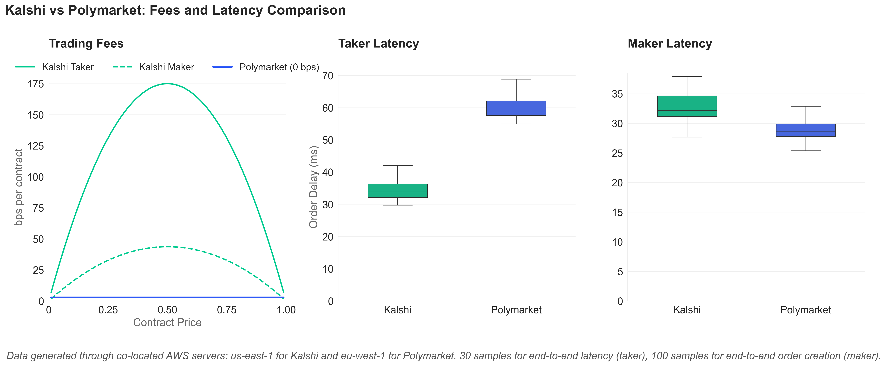
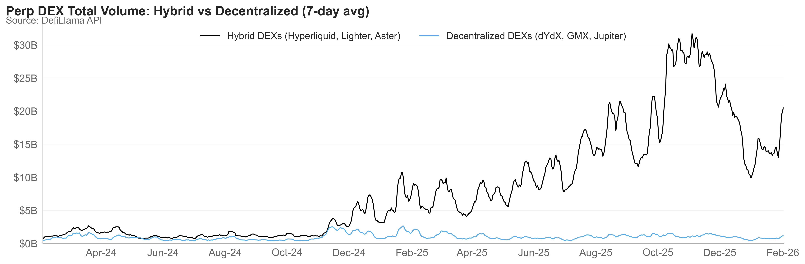
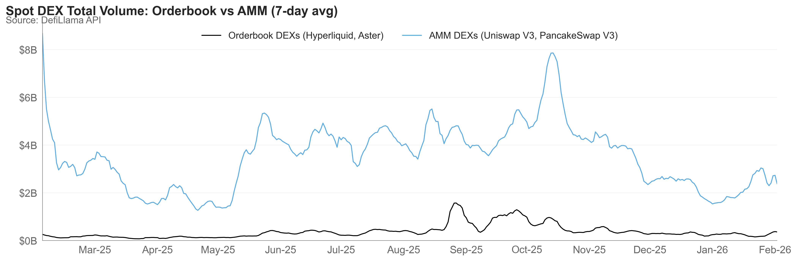

# Trading Research: Volume & Latency Analysis

Research comparing trading volumes across DEXs and prediction markets, plus latency benchmarks for Kalshi and Polymarket.

---

## Prediction Markets: Kalshi vs Polymarket

### Daily Trading Volume (1 Year)

### Fees & Latency Comparison

*Data generated through co-located AWS servers: us-east-1 for Kalshi and eu-west-1 for Polymarket. 30 samples for end-to-end taker latency, 100 samples for maker order creation.*

---

## DEX Volume Comparisons

### Perpetual DEXs: Hybrid vs Decentralized (2 Years)

**Hybrid DEXs:** Hyperliquid, Lighter, Aster  
**Decentralized DEXs:** dYdX, GMX, Jupiter

### Spot DEXs: Orderbook vs AMM (1 Year)

**Orderbook DEXs:** Hyperliquid, Aster  
**AMM DEXs:** Uniswap V3, PancakeSwap V3

---

## Data Files

### Volume Data
| File | Description |
|------|-------------|
| `kalshi_daily_volume.csv` | Kalshi daily trading volume (USD) |
| `polymarket_daily_volume.csv` | Polymarket daily trading volume (USD) |
| `kalshi_polymarket_combined_volume.csv` | Combined daily volumes |

### Latency Data
| File | Description |
|------|-------------|
| `kalshi_taker_delay.csv` | Kalshi taker fill latency samples |
| `kalshi_maker_delay.csv` | Kalshi maker order creation latency |
| `polymarket_taker_delay.csv` | Polymarket taker fill latency samples |
| `polymarket_maker_delay.csv` | Polymarket maker order creation latency |

### Fee Data
| File | Description |
|------|-------------|
| `fee_comparison.csv` | Fee structure comparison |

---

## Data Sources

- **DEX Volumes:** [DefiLlama API](https://defillama.com/)
- **Prediction Market Volumes:** [DefiLlama API](https://defillama.com/)
- **Latency Data:** Self-collected via AWS co-located servers

---

## Scripts

- `volume_comparison.py` - Generates DEX volume charts
- `kalshi_polymarket_volume.py` - Generates prediction market volume chart
- `kalshi_polymarket_comparison.py` - Generates fees & latency comparison
- `export_data.py` - Exports data to CSV format
